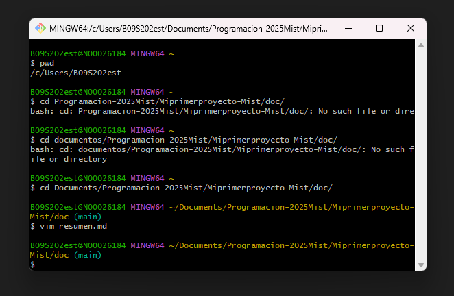

# Pasos para crear un repositorio y vincular a la nube
se crea una cuenta en la pagina de github en el navegador una vez creada se busca el icono "+" a la derecha y se crea new repository para vincular el local con la nube se necesita usar el comando "git remote add origin" y el https vinculado a la cuenta.  y para verificar que funciona se usa "git remote -v" una vez ya se encuentre todo bien y se quiere subir los guardados que tenemos de manera local se debe usar solo la primera vz el comando "git push -u origin main" ya cada vez que quieras subir algo debes usar "git add" "git commit" y "git push"
 muchas gracias